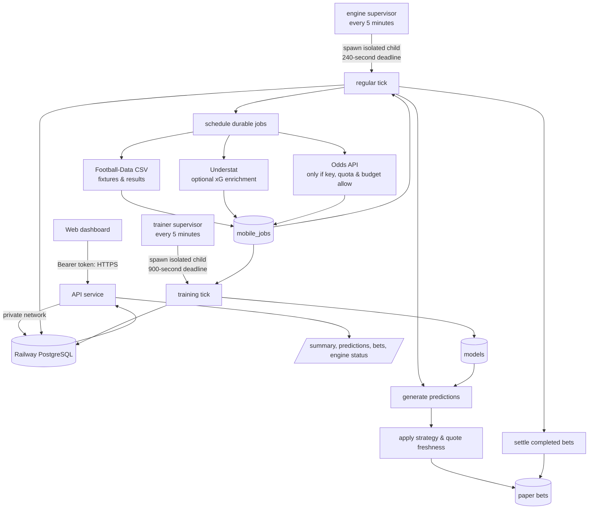

# Backend flow and failure analysis

## Live Railway snapshot — 16 September 2026, 17:09 BST

The Railway project is online: `api`, `engine`, `trainer`, and PostgreSQL each report **Online**.  The one-off `verification` service reports **Completed**. Recent API requests to `/api/v1/summary` and `/api/v1/bets` returned HTTP 200.

The `engine` and `trainer` workers are also emitting successful heartbeats. Their latest completed cycles reported `ok: true`, `errors: 0`, and `jobs: 0`. That does **not** mean the product is producing forecasts or entries: it only means no queued work was due at those particular cycles and the worker process completed cleanly.

Railway PostgreSQL is repeatedly logging `WARNING: there is already a transaction in progress`. This did not make the workers fail during the observed window, but it indicates transaction-boundary handling should be reviewed before treating the backend as fully healthy.

## Intended execution

1. The browser dashboard calls the authenticated API for its predictions, portfolio and recent worker-job state. The API reads only from PostgreSQL; it does not run collection or modelling itself.
2. The `engine` service launches a new child every five minutes. A child records an attempt, schedules durable work, refreshes predictions, decides whether an automatic paper entry qualifies, settles finished entries, then processes up to eight non-training jobs within 200 seconds.
3. The scheduler creates idempotent job IDs for five leagues. It requests public historic/current files, daily Understat enrichments, a six-hourly quota check, daily odds collection when configured, and fixtures. It avoids provider catch-up bursts by superseding stale odds work.
4. Each claimed job has a database lease. Completion marks it `done`; failure is retried with exponential backoff and becomes `failed` after three attempts. A later cycle recovers expired `running` leases.
5. The `trainer` independently claims one `train` job. Training only starts after the archive jobs are complete and at least 160 completed matches exist. It writes the model to PostgreSQL.
6. The regular engine uses the newest model plus confirmed fixtures and verified fresh quotes to generate predictions. It records an automatic paper bet only if strategy, price age, time window, edge, bankroll, and duplicate-entry conditions all pass. Settlement continues even when new entries are paused.

## Observed and possible failure points

| Area | Failure mode | Current user-visible behaviour | Risk / recommended visibility |
| --- | --- | --- | --- |
| API / database | PostgreSQL unavailable or API cannot initialise | HTTP 503 produces a generic app error | Display database status, last successful API response, retry time, and a support-safe incident ID. |
| Worker supervisor | Child exits or reaches its deadline | Railway logs `engine_cycle_failed` or `engine_timeout`; the app may only later show an overdue/degraded state | Surface last exit/timeout time and mode immediately in `/api/v1/engine`. |
| Database leases | Another process owns a lease, or a lease expires after interruption | A skipped cycle is reported as `ok: true`; recovery is only a job message | Expose `skipped`, lease owner/mode, expiry, and recovery count. Distinguish a no-op from completed productive work. |
| Job queue | No work is due | Logs report `jobs: 0`, as observed | Show a queue summary by state/kind and the next due time. `jobs: 0` must be labelled “no jobs due”, not success. |
| Job retries | A job fails fewer than three times | The job returns to `queued`; engine state can remain `running` because only terminal failures mark degraded | Show queued retries, attempt number, next retry, last safe error code, and a visible warning badge. |
| Job list ordering | API orders jobs by `available_at DESC`, then the app shows only the first eight | Important earlier failures can be hidden by later scheduled/completed jobs | Sort failures/retries first, then most recently finished; add a dedicated “Needs attention” section. |
| External feeds | Football-Data blocks/changes content, robots policy denies access, Understat schema/network fails | Some safe message is stored, but optional Understat failures do not degrade engine state | Track per-source last success, freshness, records imported, error category, and whether it blocks forecasts. |
| Odds provider | Missing key, exhausted daily budget/quota reserve, timeout, non-200, malformed JSON | No current prices; forecasts/entries can silently remain empty | Show key configured, last quote timestamp per league, credits/reserve, provider status and next permitted attempt. |
| Training | Archive backlog, fewer than 160 records, training error/time limit | No model; app says forecasts are waiting, but does not identify the blocking job | Show each league’s training readiness: archive state, sample count, model age and exact blocking reason. |
| Prediction / selection | No scheduled fixture, no model, unverified/stale quote, strategy conditions fail | “No upcoming forecasts” or no entry; aggregate skip reasons may be empty/stale | Return per-league forecast prerequisites and timestamped skip-reason counts. |
| Transaction handling | Repeated PostgreSQL “transaction already in progress” warnings | Not surfaced in the app and did not fail observed runs | Review explicit `BEGIN IMMEDIATE` translation and nested transaction usage; emit a metric/counter and alert if it recurs. |
| Observability | Railway deployment checks only startup; no external alerting is configured | A phone must be opened to notice a problem | Add an authorised out-of-band monitor for `/health` and `/health/engine`, plus alerts for terminal job failure and stale source/model/quote data. |

## Why the app can look healthy while it is not useful

`mobile_last_success` is written at the end of every successful regular tick, even when the worker processed zero jobs. `/health/engine` therefore confirms that a tick occurred within 15 minutes, rather than confirming fresh prices, trained models, forecasts, or entries. In parallel, temporary job failures are automatically returned to `queued` and do not make the engine `degraded` until they become terminal failures. Together these decisions explain a “running” app with little evidence of whether the pipeline is producing useful output.

## Priority fixes

1. Add a single API “operational readiness” object: per league, `source_fresh`, `model_ready`, `quote_fresh`, `forecast_count`, `eligible_count`, `last_error`, and `next_action_at`.
2. Change the Engine screen to show an explicit warning for retries, stale dependencies, skipped leases, zero-work cycles, stale models, and stale quotes—not only terminal `failed` jobs.
3. Add safe structured error codes to jobs and logs; retain a short user-safe message, never raw provider URLs or credentials.
4. Correct/verify PostgreSQL transaction handling so the repeated warning disappears; then add a regression test against PostgreSQL.
5. Configure external health and alert delivery after choosing an authorised destination.
